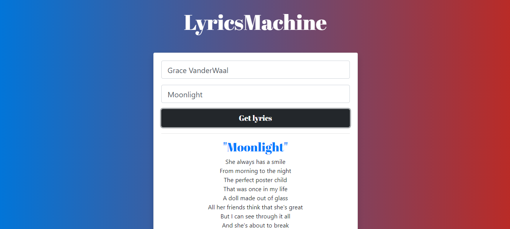

<h1 align="center">🎤 LyricsMachine 🎶</h1>

<p align="center">😊 Get the lyrics of your favorite songs instantly ✌</p>

<p align="center">
    
    
    
    
    
</p>

<p align="center">
    
</p>

<p align="center">
⭐ Hope you liked this project. <b>Give it a star!</b> 🎉<br/>

</p>


## 🚀 Deployment
📦 Install the dependencies
```bash
npm install
```
🌙 Run `webpack-dev-server` with development mode
```bash
npx webpack-dev-server -d
```


## 🎁 Dependencies
- @babel/cli: `^7.10.5`
- @babel/core: `^7.11.1`
- @babel/preset-env: `^7.11.0`
- @babel/preset-react: `^7.10.4`
- @vercel/static-build: `^0.17.8`
- babel-loader: `^8.1.0`
- bootstrap: `^4.5.2`
- css-loader: `^4.2.1`
- file-loader: `^6.0.0`
- html-webpack-plugin: `^4.3.0`
- react: `^16.13.1`
- react-dom: `^16.13.1`
- style-loader: `^1.2.1`
- webpack: `^4.44.1`
- webpack-cli: `^3.3.12`
- webpack-dev-server": `^3.11.0`


## 📃 License
Distributed under the MIT License.
See [`LICENSE`](./LICENSE) for more information.

